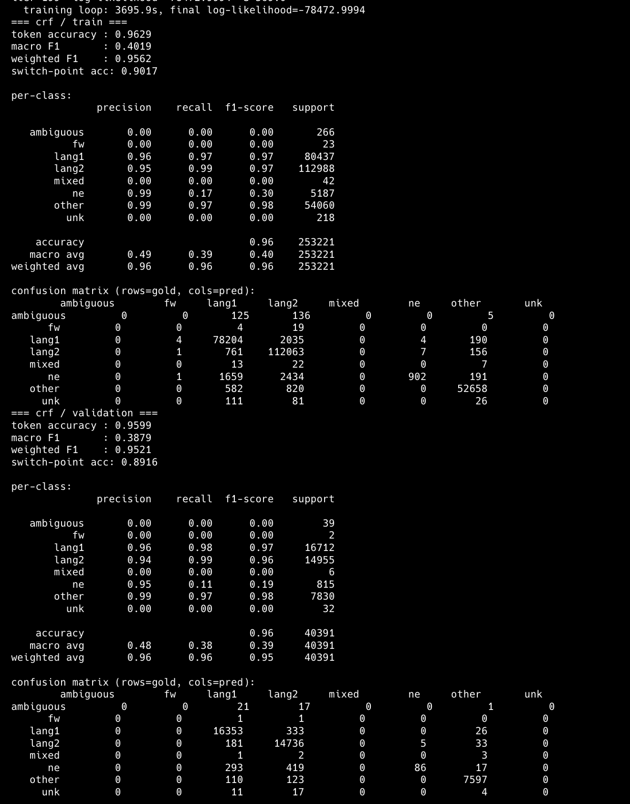
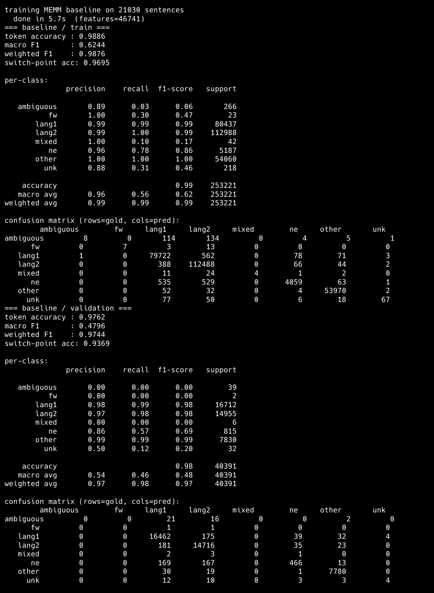

<!-- _class: title -->
<!-- _paginate: false -->

# Conditional Random Fields

## Probabilistic Models for Segmenting and Labeling Sequence Data

<div class="subtitle">Lafferty, McCallum, Pereira (2001)</div>

<div class="byline">Linear-chain CRF — implemented from scratch<br/>Christopher Bradshaw</div>

<!--
Title slide.
- Paper: Lafferty, McCallum & Pereira, ICML 2001.
- I implemented the linear-chain special case — the one that's actually deployed in practice for tasks like POS tagging, NER, and language ID.
-->

---

## Problem and Paper Overview

<div class="split">

<div>

### The setting

- **Sequence labeling**: assign a label to every token in a sequence.
- Example tasks: POS tagging, NER, shallow parsing, **language identification**.
- The structure matters — a token's best label depends on its neighbors.

</div>

<div>

### What the paper contributes

- A **discriminative** alternative to HMMs.
- Directly models _p(y | x)_ — no generative story for _x_.
- Fixes the **label-bias problem** that plagues MEMMs.
- Globally normalized → every path competes against every other path.

</div>

</div>

> _"CRFs combine the per-state expressiveness of MEMMs with the global normalization of HMMs."_

<!--
Problem and paper overview.

Sequence labeling is the task: given tokens, assign a label to each. The structure matters — "running" is VBG after "is" but NN after "the".

Before this paper: HMMs (generative, have to model p(x), independence assumptions) or MEMMs (per-state locally-normalized classifiers, suffer from label bias — the model can't "look ahead" past a low-entropy state).

The paper proposes CRFs: undirected graphical models with a single global normalizer Z(x). That one change fixes label bias and lets you pack in arbitrary overlapping features without worrying about independence.

The interesting thing is: mathematically simple, but it unlocks the door for the feature-engineering golden age of NLP (2001-2015ish) before neural nets took over.
-->

---

## Method Summary

<div class="split">

<div>

### Score of a labeling

$$
s(\mathbf{y}, \mathbf{x}) = \sum_i \Big[ \lambda \cdot f(y_{i-1}, y_i, \mathbf{x}, i) \Big]
$$

- **Emission** features tie labels to observations.
- **Transition** features tie labels to their predecessor.
- Plus **start** / **stop** boundary scores.

### Conditional probability

$$
p(\mathbf{y}|\mathbf{x}) = \frac{\exp\, s(\mathbf{y}, \mathbf{x})}{Z(\mathbf{x})}
$$

</div>

<div>

### Three key algorithms

<span class="pill">Inference</span> **Viterbi** — argmax over label sequences via dynamic programming.

<span class="pill">Training</span> **Forward-backward** — compute _Z(x)_ and marginals in log-space.

<span class="pill">Learning</span> **Algorithm S** — iterative scaling update:

```
weight[k] += (1/S) · log(observed[k] / expected[k])
```

Per feature: if gold fires it more than the model expects, push the weight up. Until they match.

</div>

</div>

<!--
Method summary.

Three pieces:
1. A score function that adds up weighted features along the sequence.
2. Divide by Z(x) — sum of exp(score) over all possible labelings — to get a probability.
3. Training: tune weights so gold sequences get high probability.

Algorithm S is the training algorithm the paper introduces. It's iterative scaling — not the L-BFGS / SGD you'd use today, but it's what the paper used and it has a nice monotonic convergence guarantee. The intuition is feature-counting: if a feature fires on 100 gold tokens but the model only expects it to fire on 60, push its weight up.

S is a scaling constant — an upper bound on the number of active features any single example contributes. Making it a valid bound is what guarantees convergence.
-->

---

## Implementation Details

<div class="split">

<div>

### What I built from scratch

- **Log-space forward-backward** (with `scipy.logsumexp` for stability).
- **Viterbi** decoding with backpointers.
- **Algorithm S** training loop with monotonic-log-likelihood check.
- Unary, pairwise, start, and stop **marginals** for expected counts.
- An **MEMM baseline** sharing the same features — locally normalized, decoded with Viterbi.

</div>

<div>

### Feature templates (per token)

- `word`, `prefix3`, `suffix2/3`
- `is_cap`, `is_all_caps`, `has_digit`
- `is_twitter_specific` (_@mentions, #hashtags, URLs_)
- `prev_word`, `next_word`

</div>

</div>

<!--
Implementation details.

Scope: linear-chain CRF. Skeleton-key: every hard operation is a DP over (position × label) with one extra axis.

The trickiest bit was the bookkeeping for Algorithm S — you have four separate weight vectors (emission, transition, start, stop) and each needs its own observed/expected counts. Getting that right means log-likelihood monotonically rises, which is the simplest correctness check.

Log-space everywhere. I learned that the hard way — early version used raw probabilities for short debug traces, underflowed on the first real sentence.

The baseline is an MEMM: multinomial logistic regression with the same observation features plus a previous-label feature, decoded with Viterbi. This lets me compare global normalization (CRF) against local normalization (MEMM), not just sequence model versus bag-of-tokens.
-->

---

## Experiment Setup

<div class="split">

<div>

### Dataset: LinCE `LID_spaeng`

Spanish-English code-switched **tweets**, token-level language IDs.

| Split | Sentences | Tokens |
|---|---:|---:|
| Train | 21,030 | 253,221 |
| Validation | 3,332 | 40,391 |
| Test | 8,289 | 97,341 |

</div>

<div>

### Label distribution (train)

| Label | Share |
|---|---:|
| `lang2` (es) | 44.6% |
| `lang1` (en) | 31.8% |
| `other` | 21.4% |
| `ne` | 2.1% |
| `ambiguous`, `mixed`, `fw`, `unk` | < 0.3% combined |

_Heavily imbalanced — the rare classes barely exist._

</div>

</div>

<!--
Experiment setup.

LinCE is the Linguistic Code-switching Evaluation benchmark. LID_spaeng is the language-ID task for Spanish-English tweets. Train and validation tokens get one of 8 labels; the committed test split has blank label placeholders.

Key thing to flag: extreme class imbalance. 97.7% of tokens are just lang1, lang2, or other. The rare classes (ambiguous, mixed, fw, unk) have single-digit to low-double-digit counts in validation. Macro F1 is going to look ugly regardless of how good the model is at the head of the distribution.

Switch-point accuracy is the metric I care about most — it's the one that rewards sequence context. At a switch point, the previous-token label flips. The CRF's transition weights should help here, and the MEMM baseline gives a local-normalization comparison point.
-->

---

## Main Results

<div class="split">

<div>

### CRF on validation

| Metric | Value | What it measures |
|---|---:|---|
| Token accuracy | **0.9599** | _fraction of tokens labeled correctly_ |
| Weighted F1 | **0.9521** | _per-class F1, weighted by support_ |
| Macro F1 | 0.3879 | _per-class F1, unweighted_ |
| Switch-point acc | **0.8916** | _accuracy at positions where gold label changes_ |

**50 iterations · ~3,696s (61 min 36 sec)**

</div>

<div>

### Per-class F1 (validation)

| Label | F1 | Support |
|---|---:|---:|
| `lang1` | 0.96 | 16,712 |
| `lang2` | 0.96 | 14,955 |
| `other` | 0.98 | 7,830 |
| `ne` | **0.19** | 815 |
| rare (ambig/mixed/fw/unk) | **0.00** | < 80 |

</div>

</div>

<!--
Main results.

Headline: 95.99% token accuracy on validation. Weighted F1 tracks accuracy (0.952) because the head of the distribution dominates.

Switch-point accuracy is 89.16%. That's the metric that says the CRF is doing something non-trivial with context.

Macro F1 of 0.39 is the ugly number. It improved because the model now catches some named entities, but the rarest classes still have F1 = 0.00. With 2-39 examples per rare class and imbalanced training, the model learns "just never predict this."

The training log-likelihood is the correctness signature. It went up every single iteration — any implementation bug (wrong sign, wrong marginal) would have broken monotonicity immediately.
-->

---

<!-- _class: centered -->

## Full Results Dump



<!--
Results screenshot.

This is the raw output of `uv run crf train`. Left column is training, right column is validation — close enough that we're not seeing runaway overfitting.

Notable rows in the confusion matrix:
- lang1 → lang1: 16,353 / 16,712 (solid)
- lang2 → lang2: 14,736 / 14,955 (solid)
- ne → ne: 86 / 815 — no longer total collapse, but recall is still only 0.11.
- other → other: 7,597 / 7,830 (solid, URLs/punctuation/emoji pattern-match well via is_twitter_specific)
-->

---

<!-- _class: centered -->

## MEMM Baseline Results



<!--
Baseline screenshot.

This is the raw output of `uv run crf baseline`. The baseline is an MEMM: locally normalized logistic regression with a prev-label feature and Viterbi decoding.

Validation headline:
- token accuracy: 0.9762
- weighted F1: 0.9744
- macro F1: 0.4796
- switch-point accuracy: 0.9369
- named-entity F1: 0.69

This is the surprising result: on this feature set and dataset, the MEMM beats the from-scratch Algorithm-S CRF. It handles named entities much better, probably because lbfgs optimization gets more useful weights for sparse features than the conservative iterative-scaling updates.
-->

---

## Analysis and Failure Cases

<div class="split">

<div>

### Where it works

- **Dominant classes** (lang1/lang2/other): 96-98% F1 — strong signal from word, suffix, and twitter-specific features.
- **Switch points**: 89.2% accuracy, clear evidence the transition weights are pulling their weight.
- **Training stability**: log-likelihood monotonically ↑ across all 200 iterations — an end-to-end correctness signal for forward-backward + Algorithm S.

</div>

<div>

### Where it struggles

- **Named entities (`ne`)**: F1 improves to 0.19, but recall is still only 0.11 — most named entities are still absorbed by `lang1`/`lang2`.
- **Rare classes**: `ambiguous`, `mixed`, `fw`, `unk` — F1 = 0. Class imbalance overwhelms Algorithm S: unregularized weights can't overcome the prior.
- **Training cost**: 62 min for 50 passes over 21k sentences. Algorithm S is an _O(N·R²)_ hit per iteration — feasible here, but L-BFGS is much faster.

</div>

</div>

<!--
Analysis.

Two bright spots, two dark spots.

Bright:
1. On the three dominant classes the model is doing real sequence labeling, and the switch-point accuracy proves the transition weights matter.
2. Monotonic log-likelihood validated the whole forward-backward / Algorithm S pipeline end-to-end.

Dark:
1. Named entities — the CRF now predicts some "ne", but recall is still low because proper-noun features (capitalization alone isn't enough on Twitter where everything is casual) don't differentiate them from English/Spanish words. A richer feature set (gazetteers, character LMs) or per-class weighting would fix this.
2. Class imbalance — Algorithm S updates weights proportional to log(observed/expected). When observed is tiny and noisy, you get tiny updates that never catch up. A regularized objective with SGD would probably not do better here either — the issue is data, not optimizer.
3. Training cost is the tax for doing it "the paper's way." The MEMM baseline trains in seconds; the CRF run takes about an hour.
-->

---

## Conclusion

<div class="split">

<div>

### What I learned

- **The math is simpler than the reputation.** Linear-chain CRF is two DPs (Viterbi, forward-backward) and a counting update rule.
- **Global normalization is elegant.** The optimizer still matters.
- **Algorithm S is beautifully self-checking.** Monotonic log-likelihood = ~100% of correctness debugging.

</div>

<div>

### Was the paper's claim supported?

<span class="pill">Partly</span> The CRF handles structured sequence labeling and uses context, but the MEMM baseline wins on this feature set.

<span class="pill">Caveat</span> The training story (Algorithm S, unregularized) is the weakest link — optimization dominates the theory here.

</div>

</div>

<div style="text-align: center; margin-top: 16px;">
<span class="stat">0.9599</span> &nbsp; <span class="stat-label">CRF validation token accuracy · LinCE LID spaeng</span>
</div>

<!--
Conclusion.

One-line takeaway: the CRF does the sequence-labeling math the paper advertises, and implementing it from scratch is mostly a bookkeeping exercise — the conceptual core is two DPs.

Paper claim supported: partly. The structured model uses context, but the locally normalized MEMM baseline is stronger here, especially on named entities. The specific training algorithm the paper uses is a historical artifact; the field moved to gradient methods quickly.
-->
